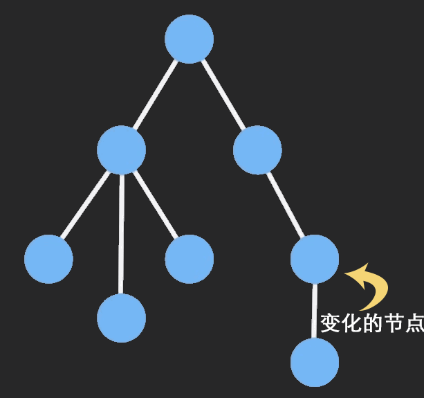

# 前言

面试过程中手写深拷贝是一个高频的面试题，自从学习了 `Immutable` 感觉深拷贝真的是 `out` 了，在深拷贝大量数据的场景中会造成严重的CPU、内存消耗，下面来学一起学习一下 `Immutable` 是如何巧妙的处理深拷贝而又可以节省不必要的内存消耗。

#  Immutable

`Immutable.js` 由 `Facebook`工程师 `Lee Byron` 花费 3 年时间打造，为应用开发提供了一系列基础的不可变数据结构，例如 List, Stack, Map, OrderedMap, Set, OrderedSet and Record，为前端开发提供了很多便利，如今 React+Redux+Immutable.js 的组合已经在项目中广泛应用。

JavaScript中像 `Object` 这种复杂数据类型，由于引用关系，在对目标对象进行属性的增、删、改等操作，很容易引起目标对象跟着变化，有时这并不是我们想要的结果。

引用示例：

```js
let foo = {a: 1};
let bar = foo;
bar.a = 2

console.log(foo)  // {a: 2}
console.log(foo)  // {a: 2}
```
> 由以上示例代码可以看出我们只修改 `bar` 的 `a` 属性，但是也对 `foo` 的 `a` 属性造成了影响。 虽然这样的引用关系使得我们不需再创建一个新的对象节约了内存的开销，但随着应用数据的复杂化使得数据不可预测，很容易造成开发上的困扰。使用浅拷贝（shallowCopy）或者深拷贝（deepCopy）可以解决一些问题，但有时我们只修改了一部分数据，却要对整个大量数据进行复制，这会造成不必要的CPU和内存消耗。

# Immutable Data

`Immutable Data` 就是一旦创建，就不能再被更改的数据。对 `Immutable` 对象的任何修改或添加删除操作都会返回一个新的 `Immutable` 对象。它的 `持久化数据结构（Persistent Data Structur）` 和 `结构共享（Structural Sharing）` 使得每一个对象都是不可变的，任何的增加、修改、删除等操作都会生成一个新的对象，并且通过 `结构共享` 等方式提高性能。

Immutable `结构共享` 示意图：


图片来源 [Immutable 详解及 React 中实践](https://github.com/camsong/blog/issues/3)

> 如果对象树中只有一个节点发生变化时，只修改改节点和受它影响的父节点，其他节点则共享

# 深拷贝实现

对于复杂类型的数据实现深拷贝，需要层层深拷贝；而浅拷贝只拷贝一层

- 基本类型变量直接复制
- 非基本类型变量则递归至基本类型变量后再复制
- 深拷贝后对象与原对象完全隔离，互不影响

> 最简单深拷贝实现:  JSON.parse(JSON.stringify(target))

`JSON.parse(JSON.stringify(target))` 虽然简单，但部分情况下无法拷贝：

1. 会忽略 `undefined`
2. 会忽略 `Symbol`
3. 不能处理正则 RegExp
4. 不能正确处理 Date类型数据
5. 对象属性是function时无法拷贝
6. 原型链上的属性无法拷贝

自己动手实现一个简单的 `deepClone` 函数，需要注意以下几点：

- 如果是基本类型数据直接返回
- 如果是复杂数据类型则递归
- 如果是 `RegExp` 或者 `Date` 类型，返回对应的类型
- 考虑循环引用问题
- 考虑Symbol

```js

function deepClone(target,wmap = new WeakMap()){
    if(target ===null || typeof target !== 'object'){
        //如果是基本类型直接返回
        return target;
    }
    if(target instanceof RegExp) return new RegExp(target)
    if(target instanceof Date) return new Date(target)
    if(wmap.has(target)){ //考虑引用
        return wmap.get(target)
    }
    let res = new target.constructor(); //如果target是Array 则 target.constructor为 [Function: Array] 
    //如果target是Object 则 target.constructor为 [Function: Object]
    wmap.set(target,res);
    let keys=[...Object.getOwnPropertyNames(target),...Object.getOwnPropertySymbols(target)]
    for(let key in keys){
        //递归
         res[key] = deepClone(target[key],wmap)
    }
    return res
}
```

# 实现一个简单的 immutable

`immutable.js` 为了实现不可变数据,自己定义了各种数据结；在此我们用js原生方法实现一个简单的immutable，很显然需要对目标对象的变更修改进行监测，这就需要 `defineProperty` 或者 `Proxy` 进行元编程。由于`defineProperty`存在一些弊端，无法检测到对象属性的新增或删除，以及对数组操作的监测也存在一些问题，`Vue3.0` 数据响应部分已经由 `ES6` 的 `Proxy` 来代替 `Object.defineProperty`实现。在此我们以`Proxy`也为例进行编码。[`Proxy` 使用详解](https://es6.ruanyifeng.com/#docs/proxy) 看阮老师 `ES6入门`。

`Proxy` 翻译成中文为 **代理** 的意思，使用它可以在目标对象之前增加一层 **拦截** ，外界所有的操作都必须先通过这层拦截，因此可以使用它来对目标对象的变更进行监测。

示例：
```js
//定义目标对象
const target = { name:'Tom', age:18 };

//定义拦截行为对象
const handler = {
    get: function(target, propKey, receiver){
        console.log(`getting ${propKey}!`);
        return Reflect.get(target, propKey, receiver);
    },
    set: function (target, propKey, value, receiver) {
        console.log(`setting ${propKey}!`);
        value = `proxy ${value}`
        return Reflect.set(target, propKey, value, receiver);
    }
}

//为目标对象增加代理拦截
const proxy = new Proxy(target, handler)

console.log(proxy.name)
proxy.name = "xiaoming"
console.log(proxy.name)

// getting name!
// Tom
// setting name!
// getting name!
// proxy xiaoming

```
由于`Immutable` 具有 `持久化数据结构（Persistent Data Structur）` 和 `结构共享（Structural Sharing）` 特性，在此我们利用 `Proxy` 的特性，在外部对目标对象进行修改操作的时候只将修改部分进行复制，其他没有修改的部分数据共享，这样既可保证不污染原始数据，也可实现深拷贝的效果，同时也节约了CPU和内存的消耗。最终保证数据不可变。

1. 首先定义一个类，维护数据操作的状态
   
```js
class Immutable {
    modified = false; // 是否被修改
    target = undefined; // 目标对象
    copy = undefined; // 拷贝的对象

    constructor(target){
        this.target = target;
    }

    //如果目标对象没有被修改，直接返回原对象的某个值，否则返回拷贝对象的某个值
    get(key){
        if (!this.modified) return this.target[key];
        return this.copy[key];
    }

    //如果目标对象没有被修改，对目标对象进行标记修改，否则修改拷贝的对象
    set(key,value){
        if(!this.modified) this.handleChanged()
        return (this.copy[key] = value);
    }

    handleChanged(){
        if(!this.modified){
            this.modified = true;
            //浅拷贝结构共享
            this.copy = shallowCopy(this.target)
        }
    }
}

function shallowCopy(value){
    if(Array.isArray(value)) return value.slice();
    if(value.__proto__ == undefined){
        return Object.assign(Object.create(null),value)
    }
    return Object.assign({}, value)
}
```
> 以上代码实现了一个具有获取、修改目标对象属性的基础 Immutable 类，根据 `modified` 的值判读目标对象是否被修改过，如果没有被修改则直接返回目标对象属性，否则返回拷贝后的对象属性。

2. 使用 `Proxy` 给目标对象增加代理方法，检测是否被改变，并返回相对应的结果。
   
```js
const PROXY_STATE = Symbol('state')
//对目标对象的操作行为拦截
const handler = {
    get: function(target, propKey){
        if(propKey === PROXY_STATE) return target
        return target.get(propKey);
    },
    set: function (target, propKey, value) {
        return target.set(propKey, value);
    }
}
/**
 * @param {object} target 目标对象
 * @param {function} producer 对目标对象进行操作的方法
 */
function produce(target,producer){
    const store = new Immutable(target);
    const proxy = new Proxy(store,handler)
    producer(proxy)

    const newState = proxy[PROXY_STATE]

    if(newState.modified) return newState.copy;

    return newState.target
}
```
3. 验证对目标函数的操作是否会影响到原始数据

```js
let target = {
    name:'tom',
    age:18,
    address:{
        country:'China',
        province:'Henan'
    },
    hobby:{
        sport:['basketball','run'],
        art:['draw']
    }
}

const result = produce(target,res=>{
    res.name='xiaoming'
})
console.log(target,result)

// {
//   name: 'tom',
//   age: 18,
//   address: { country: 'China', province: 'Henan' },
//   hobby: { sport: [ 'basketball', 'run' ], art: [ 'draw' ] }
// } {
//   name: 'xiaoming',
//   age: 18,
//   address: { country: 'China', province: 'Henan' },
//   hobby: { sport: [ 'basketball', 'run' ], art: [ 'draw' ] }
// }

console.log('1',target.address===result.address,target.hobby===result.hobby) // 1 true true

const result2 = produce(target,res=>{
    res.address={
        country:'China',
        province:'Beijing'
    }
})

console.log(target,result2)

// {
//   name: 'tom',
//   age: 18,
//   address: { country: 'China', province: 'Henan' },
//   hobby: { sport: [ 'basketball', 'run' ], art: [ 'draw' ] }
// } {
//   name: 'tom',
//   age: 18,
//   address: { country: 'China', province: 'Beijing' },
//   hobby: { sport: [ 'basketball', 'run' ], art: [ 'draw' ] }
// }

console.log('2',target.address===result2.address,target.hobby===result2.hobby) //2 false true
```

> 根据以上代码运行结果分析，我们对目标对象的修改，只影响修改部分与原始目标对象不同，其余部分与原始目标对象保持一致。

到此为止我们已经实现了一个低配版本的 `Immutable`，跟深拷贝比起来确实有很高的性能提升，值得深入研究学习。
本文对 `Immutable`进行的简单的介绍，如需更多了解请移步源码[immutable-js](https://github.com/immutable-js/immutable-js) 、 [immer](https://github.com/immerjs/immer) 深入学习

# 参考

- [实现不可变数据](https://www.cxymsg.com/guide/immutable.html)
- [Immutable 详解及 React 中实践](https://github.com/camsong/blog/issues/3)
- [Immutable.js 原理与源码解析](https://blog.csdn.net/qq_35368183/article/details/89241827)
- [深入探究immutable.js的实现机制](https://zhuanlan.zhihu.com/p/44571842)