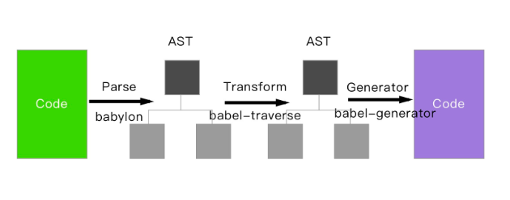

# babel的原理是什么

babel的转译过程分为三个阶段
- 解析Parse：将代码解析生成抽象语法树（AST），即词法分析、语法分析的过程
- 转换Transform：对于AST进行变换一系列的操作，babel接受得到AST并通过babel-traverse对其进行遍历，在此过程中进行添加、更新及移除等操作
- 生成Generate：将变换后的AST再转换成JS代码，使用到的模块是babel-generator



# 如何写一个babel

**Babel解析生成AST然后插件更改AST，最后由Babel输出代码**

那么Babel的插件模块需要你暴露一个function，function内返回visitor
```js
module.export=function(babel){
    return {
        visitor:{

        }
    }
}
```
visitor是对各类型的AST节点做处理的地方，那么我们怎么知道Babel生成的AST有哪些节点呢？可以把Babel转换的结果打印出来，或者这里有传送门：[AST explorer](https://astexplorer.net/)

这里我们可以通过`const result=1+2`中的`1+2`是一个`BinaryExpression`节点，那么在visitor中，我们就处理这个节点
```js
// const babel  = require("babel-core");
const t  = require("babel-types");
const visitor={
    BinaryExpression(path){
        const node=path.node;
        let result;
        //判断表达式两边，是否都是数字
        if(t.isNumericLiteral(node.left) && t.isNumericLiteral(node.right)){
            //根据不同的操作运算符作运算
            switch (node.operator) {
                case "+":
                    result=node.left.value+node.right.value;
                    break;
                case "+":
                    result=node.left.value+node.right.value;
                    break;
                case "-":
                    result=node.left.value-node.right.value;
                    break;
                case "*":
                    result=node.left.value*node.right.value;
                    break;
                case "/":
                    result=node.left.value/node.right.value;
                    break;
                case "**":
                    let i=node.right.value;
                    while (--i) {
                        result=result||node.left.value;
                        result=result*node.left.value
                    }
                    result=node.left.value+node.right.value;
                    break;
                default:
                    break;
            }
        }
        //如果上面的运算有结果的话
        if(result!==undefined){
            //把表达式节点替换成number字面量
            path.replaceWith(t.numericLiteral(result))
        }
    }
}

module.exports=function(babel){
    return {
        visitor
    }
}

```
运行插件
```js
const babel  = require("babel-core");
const result = babel.transform('const result= 1+2',{
    plugins:[
        require('./index')
    ]
})
console.log(result.code) // const result = 3;
```
与预期一致，那么转换const result=1+2+3+4呢
```js
const babel  = require("babel-core");
const result = babel.transform('const result= 1+2+3+4',{
    plugins:[
        require('./index')
    ]
})
console.log(result.code) // const result = 3 + 3 + 4;
```
结果为`const result = 3 + 3 + 4;`

计算完1+2之后就没有继续往下运算了，我们看一下这个表达式的AST树

你会发现Babel解析成表达式里面嵌套表达式
```js
表达式( 表达式( 表达式(1 + 2) + 3) + 4) 
```
而我们的判断条件并不符合所有的，只符合`1+2`
```js
//判断表达式两边，是否都是数字
if(t.isNumbericLiteral(node.left) && t.isNumbericLiteral(node.right)){

}
```
那我们得改一改
第一次计算1+2之后我们会得到这样的表达式
```js
表达式( 表达式(3 + 3) + 4)
```
其中3+3又符合了我们的条件，我们通过向上递归的方式遍历父节点又转换成这样
```js
表达式( 6 + 4)
10
```
```js
//如果上面的运算有结果的话
    if(result!==undefined){
        //把表达式节点替换成number字面量
        path.replaceWith(t.numericLiteral(result))
        let parentPath=path.parentPath;
        //向上遍历父节点
        parentPath && visitor.BinaryExpression.call(this,parentPath)
    }
```
运算结果得出  const result = 10;

[上述答案来源于](https://cnodejs.org/topic/5a9317d38d6e16e56bb808d1)

[更详细教程移步](https://github.com/jamiebuilds/babel-handbook/blob/master/translations/zh-Hans/plugin-handbook.md#builders)

# 代码解析

parser 概念
代码解析，也就是我们常说的Parser,用于将一段代码（文本）解析成一个数据结构

例如这段es6代码
```js
const add=(a,b)=>a+b
```
我们用babel解析后便是这种形式：
```js
{
  "type": "File",
  "start": 0,
  "end": 27,
  "loc": {
    "start": {
      "line": 1,
      "column": 0
    },
    "end": {
      "line": 1,
      "column": 27
    }
  },
  "program": {
    "type": "Program",
    "start": 0,
    "end": 27,
    "loc": {
      "start": {
        "line": 1,
        "column": 0
      },
      "end": {
        "line": 1,
        "column": 27
      }
    },
    "sourceType": "module",
    "body": [
      {
        "type": "VariableDeclaration",
        "start": 0,
        "end": 27,
        "loc": {
          "start": {
            "line": 1,
            "column": 0
          },
          "end": {
            "line": 1,
            "column": 27
          }
        },
        "declarations": [
          {
            "type": "VariableDeclarator",
            "start": 6,
            "end": 27,
            "loc": {
              "start": {
                "line": 1,
                "column": 6
              },
              "end": {
                "line": 1,
                "column": 27
              }
            },
            "id": {
              "type": "Identifier",
              "start": 6,
              "end": 9,
              "loc": {
                "start": {
                  "line": 1,
                  "column": 6
                },
                "end": {
                  "line": 1,
                  "column": 9
                },
                "identifierName": "add"
              },
              "name": "add"
            },
            "init": {
              "type": "ArrowFunctionExpression",
              "start": 12,
              "end": 27,
              "loc": {
                "start": {
                  "line": 1,
                  "column": 12
                },
                "end": {
                  "line": 1,
                  "column": 27
                }
              },
              "id": null,
              "generator": false,
              "expression": true,
              "async": false,
              "params": [
                {
                  "type": "Identifier",
                  "start": 13,
                  "end": 14,
                  "loc": {
                    "start": {
                      "line": 1,
                      "column": 13
                    },
                    "end": {
                      "line": 1,
                      "column": 14
                    },
                    "identifierName": "a"
                  },
                  "name": "a"
                },
                {
                  "type": "Identifier",
                  "start": 16,
                  "end": 17,
                  "loc": {
                    "start": {
                      "line": 1,
                      "column": 16
                    },
                    "end": {
                      "line": 1,
                      "column": 17
                    },
                    "identifierName": "b"
                  },
                  "name": "b"
                }
              ],
              "body": {
                "type": "BinaryExpression",
                "start": 22,
                "end": 27,
                "loc": {
                  "start": {
                    "line": 1,
                    "column": 22
                  },
                  "end": {
                    "line": 1,
                    "column": 27
                  }
                },
                "left": {
                  "type": "Identifier",
                  "start": 22,
                  "end": 23,
                  "loc": {
                    "start": {
                      "line": 1,
                      "column": 22
                    },
                    "end": {
                      "line": 1,
                      "column": 23
                    },
                    "identifierName": "a"
                  },
                  "name": "a"
                },
                "operator": "+",
                "right": {
                  "type": "Identifier",
                  "start": 26,
                  "end": 27,
                  "loc": {
                    "start": {
                      "line": 1,
                      "column": 26
                    },
                    "end": {
                      "line": 1,
                      "column": 27
                    },
                    "identifierName": "b"
                  },
                  "name": "b"
                }
              }
            }
          }
        ],
        "kind": "const"
      }
    ],
    "directives": []
  }
}
```

我们以上面的es6剪头函数为目标，来写一个简单的parser

- 词法分析：将代码（字符串）分隔为token流，即**语法单元**成的数组
- 语法分析: 分析token流（上面生成的数组）并生成AST

# 词法分析（Tokenizer --词法分析器）

要做词法分析，首先我们需要明白你在JavaScript中哪些属于**语法单元**

- 数字：JavaScript中的科学计数法以及普通数组都属于语法单元。
- 括号：`( )` 只要出现，不管任何意义都算是语法单元
- 标识符：连续字符，常见的变量、常亮（例如：null true），关键字（if break）等等
- 运算符：+ - * / 等等
- 当然还有注释，中括号等等

> 在parser的过程中，应该换一个角度看待代码，我们平时工作用的代码，本质就是字符串或者一段文本，没有任何意义，是JavaScript引擎赋予了它意义，所以我们在解析过程中代码只是一段字符串

仍然是下面的代码
```js
const add=(a,b)=>a+b
```
我们期望的结果类似这样的
```js
[
  { type: "identifier", value: "const" },
  { type: "whitespace", value: " " },
  ...
]
```
那么我们现在就来打造一个词法分析器（Tokenizer）