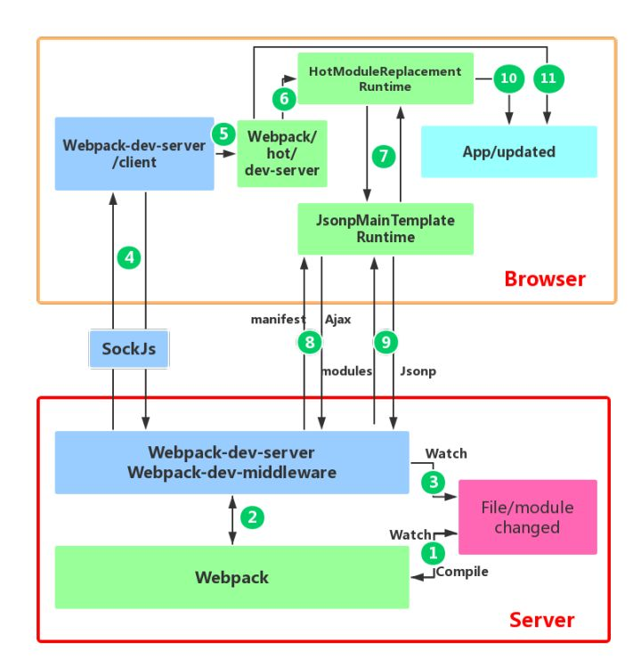

# webpack与grunt、gulp的不同？
Grunt、Gulp是基于任务运行的工具：

它们会自动执行指定的任务，就像流水线，把资源放上去然后通过不同插件进行加工，它们包含活跃的社区，丰富的插件，能方便的打造各种工作流。

Webpack是基于模块化打包的工具:

自动化处理模块,webpack把一切当成模块，当 webpack 处理应用程序时，它会递归地构建一个依赖关系图(dependency graph)，其中包含应用程序需要的每个模块，然后将所有这些模块打包成一个或多个 bundle。

因此这是完全不同的两类工具,而现在主流的方式是用npm script代替Grunt、Gulp,npm script同样可以打造任务流。

# webpack、rollup、parcel优劣？

- webpack适用于大型复杂的前端站点构建: webpack有强大的loader和插件生态,打包后的文件实际上就是一个立即执行函数，这个立即执行函数接收一个参数，这个参数是模块对象，键为各个模块的路径，值为模块内容。立即执行函数内部则处理模块之间的引用，执行模块等,这种情况更适合文件依赖复杂的应用开发.

- rollup适用于基础库的打包，如vue、d3等: Rollup 就是将各个模块打包进一个文件中，并且通过 Tree-shaking 来删除无用的代码,可以最大程度上降低代码体积,但是rollup没有webpack如此多的的如代码分割、按需加载等高级功能，其更聚焦于库的打包，因此更适合库的开发.

- parcel适用于简单的实验性项目: 他可以满足低门槛的快速看到效果,但是生态差、报错信息不够全面都是他的硬伤，除了一些玩具项目或者实验项目不建议使用

# 有哪些常见的Loader？

- `file-loader`：把文件输出到一个文件夹中，在代码中通过相对 URL 去引用输出的文件
- `url-loader`：和 file-loader 类似，但是能在文件很小的情况下以 base64 的方式把文件内容注入到代码中去
- `source-map-loader`：加载额外的 Source Map 文件，以方便断点调试
- `image-loader`：加载并且压缩图片文件
- `babel-loader`：把 ES6 转换成 ES5
- `css-loader`：加载 CSS，支持模块化、压缩、文件导入等特性
- `style-loader`：把 CSS 代码注入到 JavaScript 中，通过 DOM 操作去加载 CSS。
- `eslint-loader`：通过 ESLint 检查 JavaScript 代码

# 有哪些常见的Plugin？

- `define-plugin`：定义环境变量
- `html-webpack-plugin`：简化html文件创建
- `uglifyjs-webpack-plugin`：通过UglifyJS压缩ES6代码
- `webpack-parallel-uglify-plugin`: 多核压缩,提高压缩速度， node 是单线程的，但node能够fork子进程，基于此，`webpack-parallel-uglify-plugin` 能够把任务分解给多个子进程去并发的执行，子进程处理完后再把结果发送给主进程，从而实现并发编译，进而大幅提升js压缩速度
- `webpack-bundle-analyzer`: 可视化webpack输出文件的体积
- `mini-css-extract-plugin`: CSS提取到单独的文件中,支持按需加载

```js
const ParallelUglifyPlugin = require('webpack-parallel-uglify-plugin');

// ...
optimization: {
    minimizer: [
        new ParallelUglifyPlugin({ // 多进程压缩
            cacheDir: '.cache/',
            uglifyJS: {
                output: {
                    comments: false,
                    beautify: false
                },
                compress: {
                    warnings: false,
                    drop_console: true,
                    collapse_vars: true,
                    reduce_vars: true
                }
            }
        }),
    ]
}
```
# 分别介绍bundle，chunk，module是什么

- bundle：是由webpack打包出来的文件
- chunk：代码块，一个chunk由多个模块组合而成，用于代码的合并和分割
- module：是开发中的单个模块，在webpack的世界，一切皆模块，一个模块对应一个文件，webpack会从配置的entry中递归开始找出所有依赖的模块

# Loader和Plugin的不同？

**不同的作用：**
- Loader直译为"加载器"。Webpack将一切文件视为模块，但是webpack原生是只能解析js文件，如果想将其他文件也打包的话，就会用到loader。 所以Loader的作用是让webpack拥有了加载和解析_非JavaScript文件_的能力。
- Plugin直译为"插件"。Plugin可以扩展webpack的功能，让webpack具有更多的灵活性。 在 Webpack 运行的生命周期中会广播出许多事件，Plugin 可以监听这些事件，在合适的时机通过 Webpack 提供的 API 改变输出结果。

**不同的用法：**

- Loader在module.rules中配置，也就是说他作为模块的解析规则而存在。 类型为数组，每一项都是一个Object，里面描述了对于什么类型的文件（test），使用什么加载(loader)和使用的参数（options）
- Plugin在plugins中单独配置。 类型为数组，每一项是一个plugin的实例，参数都通过构造函数传入。

# webpack的构建流程是什么?

Webpack 的运行流程是一个串行的过程，从启动到结束会依次执行以下流程：

1. 初始化参数：从配置文件和 Shell 语句中读取与合并参数，得出最终的参数；
2. 开始编译：用上一步得到的参数初始化 Compiler 对象，加载所有配置的插件，执行对象的 run 方法开始执行编译；
3. 确定入口：根据配置中的 entry 找出所有的入口文件；
4. 编译模块：从入口文件出发，调用所有配置的 Loader 对模块进行翻译，再找出该模块依赖的模块，再递归本步骤直到所有入口依赖的文件都经过了本步骤的处理；
5. 完成模块编译：在经过第4步使用 Loader 翻译完所有模块后，得到了每个模块被翻译后的最终内容以及它们之间的依赖关系；
6. 输出资源：根据入口和模块之间的依赖关系，组装成一个个包含多个模块的 Chunk，再把每个 Chunk 转换成一个单独的文件加入到输出列表，这步是可以修改输出内容的最后机会；
7. 输出完成：在确定好输出内容后，根据配置确定输出的路径和文件名，把文件内容写入到文件系统。

在以上过程中，Webpack 会在特定的时间点广播出特定的事件，插件在监听到感兴趣的事件后会执行特定的逻辑，并且插件可以调用 Webpack 提供的 API 改变 Webpack 的运行结果

# 是否写过Loader和Plugin？描述一下编写loader或plugin的思路？

Loader像一个"翻译官"把读到的源文件内容转义成新的文件内容，并且每个Loader通过链式操作，将源文件一步步翻译成想要的样子。

编写Loader时要遵循单一原则，每个Loader只做一种"转义"工作。 每个Loader的拿到的是源文件内容（source），可以通过返回值的方式将处理后的内容输出，也可以调用this.callback()方法，将内容返回给webpack。 还可以通过 this.async()生成一个callback函数，再用这个callback将处理后的内容输出出去。 此外webpack还为开发者准备了开发loader的工具函数集——loader-utils。

相对于Loader而言，Plugin的编写就灵活了许多。 webpack在运行的生命周期中会广播出许多事件，Plugin 可以监听这些事件，在合适的时机通过 Webpack 提供的 API 改变输出结果。

# webpack的热更新是如何做到的？说明其原理？

webpack的热更新又称热替换（Hot Module Replacement），缩写为HMR。 这个机制可以做到不用刷新浏览器而将新变更的模块替换掉旧的模块。

**原理：**



首先要知道server端和client端都做了处理工作

- 第一步，在 webpack 的 watch 模式下，文件系统中某一个文件发生修改，webpack 监听到文件变化，根据配置文件对模块重新编译打包，并将打包后的代码通过简单的 JavaScript 对象保存在内存中。
- 第二步是 webpack-dev-server 和 webpack 之间的接口交互，而在这一步，主要是 dev-server 的中间件 webpack-dev-middleware 和 webpack 之间的交互，webpack-dev-middleware 调用 webpack 暴露的 API对代码变化进行监控，并且告诉 webpack，将代码打包到内存中。
- 第三步是 webpack-dev-server 对文件变化的一个监控，这一步不同于第一步，并不是监控代码变化重新打包。当我们在配置文件中配置了devServer.watchContentBase 为 true 的时候，Server 会监听这些配置文件夹中静态文件的变化，变化后会通知浏览器端对应用进行 live reload。注意，这儿是浏览器刷新，和 HMR 是两个概念。
- 第四步也是 webpack-dev-server 代码的工作，该步骤主要是通过 sockjs（webpack-dev-server 的依赖）在浏览器端和服务端之间建立一个 websocket 长连接，将 webpack 编译打包的各个阶段的状态信息告知浏览器端，同时也包括第三步中 Server 监听静态文件变化的信息。浏览器端根据这些 socket 消息进行不同的操作。当然服务端传递的最主要信息还是新模块的 hash 值，后面的步骤根据这一 hash 值来进行模块热替换。
- webpack-dev-server/client 端并不能够请求更新的代码，也不会执行热更模块操作，而把这些工作又交回给了 webpack，webpack/hot/dev-server 的工作就是根据 webpack-dev-server/client 传给它的信息以及 dev-server 的配置决定是刷新浏览器呢还是进行模块热更新。当然如果仅仅是刷新浏览器，也就没有后面那些步骤了。
- HotModuleReplacement.runtime 是客户端 HMR 的中枢，它接收到上一步传递给他的新模块的 hash 值，它通过 JsonpMainTemplate.runtime 向 server 端发送 Ajax 请求，服务端返回一个 json，该 json 包含了所有要更新的模块的 hash 值，获取到更新列表后，该模块再次通过 jsonp 请求，获取到最新的模块代码。这就是上图中 7、8、9 步骤。
- 而第 10 步是决定 HMR 成功与否的关键步骤，在该步骤中，HotModulePlugin 将会对新旧模块进行对比，决定是否更新模块，在决定更新模块后，检查模块之间的依赖关系，更新模块的同时更新模块间的依赖引用。
- 最后一步，当 HMR 失败后，回退到 live reload 操作，也就是进行浏览器刷新来获取最新打包代码。

> 详细原理解析来源于知乎饿了么前端[Webpack HMR 原理解析](https://zhuanlan.zhihu.com/p/30669007)

# 如何用webpack来优化前端性能？

用webpack优化前端性能是指优化webpack的输出结果，让打包的最终结果在浏览器运行快速高效

- 压缩代码：删除多余的代码、注释、简化代码的写法等等方式。可以利用webpack的`UglifyJsPlugin`和`ParallelUglifyPlugin`来压缩JS文件，利用`cssnano`(css-loader?minimize)来压缩css
- 利用CDN加速：在构建过程中，将引用的静态资源路径修改CDN上对应的路径。可以利用webpack的`output`参数和各loader的`publicPath`参数来修改资源路径
- Tree Shaking:将代码中永远不会走到的片段删除掉，可以通过在启动webpack时追加参数 `--optimize-minimize`来实现
- Code Splitting:将代码按路由维度或者组件分块（chunk）,这样做到按需加载，同时可以充分利用浏览器缓存
- 提取公共第三方库：`SplitChunksPlugin`插件来进行公共模块抽离，利用浏览器缓存可以长期缓存这些无需频繁变动的公共代码

# 如何提高webpack的打包速度

- HappyPack：利用进程并行编译loader，利用缓存来使得rebuild更快，遗憾的是作者表示已经不会再继续开发此项目，类似的替代者是[thread-loader](https://github.com/webpack-contrib/thread-loader)
- [外部扩展（externals）](https://webpack.docschina.org/configuration/externals/): 将不怎么需要更新的第三方库脱离webpack打包，不被打入bundle中，从而减轻少打包时间，比如jQuery用script标签引入
- dll: 采用webpack的DllPlugin和DllReferencePlugin引入dll，让一些基本不会变动的代码打包成静态资源，避免反复编译浪费时间
- 利用缓存：`webpack.cache`、`bable-loader.cacheDirectory`、`HappyPack.cache`都可以利用缓存提高rebuild效率
- 缩小文件搜索的范围：比如babel-loader插件，如果你的文件仅存在与src中，那么可以使用`include:path.resolve(__dirname,'src')`,当然绝大多数情况下这种操作的提升有限，除非不小心build了`node_modules`文件

> 实战文章推荐[使用webpack4提升180%编译速度Tool](https://louiszhai.github.io/2019/01/04/webpack4/)

# 如何提高webpack的构建速度
- 多入口情况下，使用`CommonsChunkPlugin`（webpack4中已废弃）来提取公共代码，在webpack4中由`optimization.splitChunks`和`optimization.runtimeChunk`替代，前者拆分代码，后者提取runtime代码。原来的`CommonsChunkPlugin`产出模块时，会包含重复的代码，并且无法优化异步模块，minchunks的配置也较复杂，`splitChunks`解决了这个问题；另外将`optimization.runtimeChunk`设置为true或{name:"manifest"},便能将入口模块中的runtime部分提取出来
- 通过`externals`配置来提取常用库
- 利用`DllPlugin`和`DllReferencePlugin`预编译资源模块，通过`DllPlugin`来对那些我们引用引用绝对不会修改的npm包来进行预编译，再使用`DllReferencePlugin`将预编译的模块加载进来
- 使用`HappyPack`或者[thread-loader](https://github.com/webpack-contrib/thread-loader)来实现多线程加速编译
- 使用`webpack-uglify-parallel`来提升`uglifyPlugin`的压缩速度。原理上`webpack-uglify-parallel`采用多核并行压缩来提升压缩的速度
- 使用`Tree-shaking`和`Scope Hoisting`来剔除多余的代码

webpack4 的默认配置
```js
optimization: {
    minimize: env === 'production' ? true : false, // 开发环境不压缩
    splitChunks: {
        chunks: "async", // 共有三个值可选：initial(初始模块)、async(按需加载模块)和all(全部模块)
        minSize: 30000, // 模块超过30k自动被抽离成公共模块
        minChunks: 1, // 模块被引用>=1次，便分割
        maxAsyncRequests: 5,  // 异步加载chunk的并发请求数量<=5
        maxInitialRequests: 3, // 一个入口并发加载的chunk数量<=3
        name: true, // 默认由模块名+hash命名，名称相同时多个模块将合并为1个，可以设置为function
        automaticNameDelimiter: '~', // 命名分隔符
        cacheGroups: { // 缓存组，会继承和覆盖splitChunks的配置
            default: { // 模块缓存规则，设置为false，默认缓存组将禁用
                minChunks: 2, // 模块被引用>=2次，拆分至vendors公共模块
                priority: -20, // 优先级
                reuseExistingChunk: true, // 默认使用已有的模块
            },
            vendors: {
                test: /[\\/]node_modules[\\/]/, // 表示默认拆分node_modules中的模块
                priority: -10
            }
        }
    }
}
```
splitChunks是拆包优化的重点，如果你的项目中包含element-ui等第三方组件（组件比较大），建议单独拆包，如下所示
```js
splitChunks: {
    // ...
    cacheGroups: {    
        elementUI: {
            name: "chunk-elementUI", // 单独将 elementUI 拆包
            priority: 15, // 权重需大于其它缓存组
            test: /[\/]node_modules[\/]element-ui[\/]/
        }
    }
}
```
loader 解析速度如何提升。同 webpack-parallel-uglify-plugin 插件一样，HappyPack 也能实现并发编译，从而可以大幅提升 loader 的解析速度， 如下是部分配置。
```js
const HappyPack = require('happypack');
const happyThreadPool = HappyPack.ThreadPool({ size: os.cpus().length });
const createHappyPlugin = (id, loaders) => new HappyPack({
    id: id,
    loaders: loaders,
    threadPool: happyThreadPool,
    verbose: process.env.HAPPY_VERBOSE === '1' // make happy more verbose with HAPPY_VERBOSE=1
});
```
对于前面 loader: "happypack/loader?id=happy-babel" 这句，便需要在 plugins 中创建一个 happy-babel 的插件实例。
```js
plugins: [
    createHappyPlugin('happy-babel', [{
        loader: 'babel-loader',
        options: {
            babelrc: true,
            cacheDirectory: true // 启用缓存
        }
    }])
]
```
另外，像 vue-loader、css-loader 都支持 happyPack 加速，如下所示。
```js
plugins: [
    createHappyPlugin('happy-css', ['css-loader', 'vue-style-loader']),
    new HappyPack({
        loaders: [{
            path: 'vue-loader',
            query: {
                loaders: {
                    scss: 'vue-style-loader!css-loader!postcss-loader!sass-loader?indentedSyntax'
                }
            }
        }]
    })
]
```
1. 我们都知道，webpack打包时，有一些框架代码是基本不变的，比如说 babel-polyfill、vue、vue-router、vuex、axios、element-ui、fastclick 等，这些模块也有不小的 size，每次编译都要加载一遍，比较费时费力。使用 DLLPlugin 和 DLLReferencePlugin 插件，便可以将这些模块提前打包。

```js
//webpack.dll.config.js
const webpack = require("webpack");
const path = require('path');
const CleanWebpackPlugin = require("clean-webpack-plugin");
const dllPath = path.resolve(__dirname, "../../src/assets/dll"); // dll文件存放的目录

module.exports = {
    entry: {
        // 把 vue 相关模块的放到一个单独的动态链接库
        vue: ["babel-polyfill", "fastclick", "vue", "vue-router", "vuex", "axios", "element-ui"]
    },
    output: {
        filename: "[name]-[hash].dll.js", // 生成vue.dll.js
        path: dllPath,
        library: "_dll_[name]"
    },
    plugins: [
        new CleanWebpackPlugin(["*.js"], { // 清除之前的dll文件
            root: dllPath,
        }),
        new webpack.DllPlugin({
            name: "_dll_[name]",
            // manifest.json 描述动态链接库包含了哪些内容
            path: path.join(__dirname, "./", "[name].dll.manifest.json")
        }),
    ],
};
```
接着， 需要在 package.json 中新增 dll 命令。
```json
"scripts": {
    "dll": "webpack --mode production --config build/webpack.dll.config.js"
}
```
运行 npm run dll 后，会生成 ./src/assets/dll/vue.dll-[hash].js 公共js 和 ./build/vue.dll.manifest.json 资源说明文件，至此 dll 准备工作完成，接下来在 webpack 中引用即可。
```js
externals: {
    'vue': 'Vue',
    'vue-router': 'VueRouter',
    'vuex': 'vuex',
    'elemenct-ui': 'ELEMENT',
    'axios': 'axios',
    'fastclick': 'FastClick'
},
plugins: [
    ...(config.common.needDll ? [
        new webpack.DllReferencePlugin({
            manifest: require("./vue.dll.manifest.json")
        })
    ] : [])
]
```
dll 公共js轻易不会变化，假如在将来真的发生了更新，那么新的dll文件名便需要加上新的hash，从而避免浏览器缓存老的文件，造成执行出错。由于 hash 的不确定性，我们在 html 入口文件中没办法指定一个固定链接的 script 脚本，刚好，add-asset-html-webpack-plugin 插件可以帮我们自动引入 dll 文件。
```js
const autoAddDllRes = () => {
    const AddAssetHtmlPlugin = require('add-asset-html-webpack-plugin');
    return new AddAssetHtmlPlugin([{ // 往html中注入dll js
        publicPath: config.common.publicPath + "dll/",  // 注入到html中的路径
        outputPath: "dll", // 最终输出的目录
        filepath: resolve("src/assets/dll/*.js"),
        includeSourcemap: false,
        typeOfAsset: "js" // options js、css; default js
    }]);
};

// ...
plugins: [
    ...(config.common.needDll ? [autoAddDllRes()] : [])
]
```
# 怎么配置单页面应用、多页面应用

单页面应用可以理解为webpack的标准模式，直接在`entry`中指定单页面应用的入口即可

多页面应用的话，可以使用webpack的`AutoWebPlugin`来完成简单自动化的构建，但是前提是项目的目录结构也必须遵守他预设的规范。

**多页面应用注意事项：**

- 每个页面都有公共的代码，可以将这些代码抽离出来，避免重复的加载。
- 随着业务的不断扩展，页面可能会不断的追加，所以一定要让入口的配置足够灵活，避免每次添加新页面还需要修改构建配置
