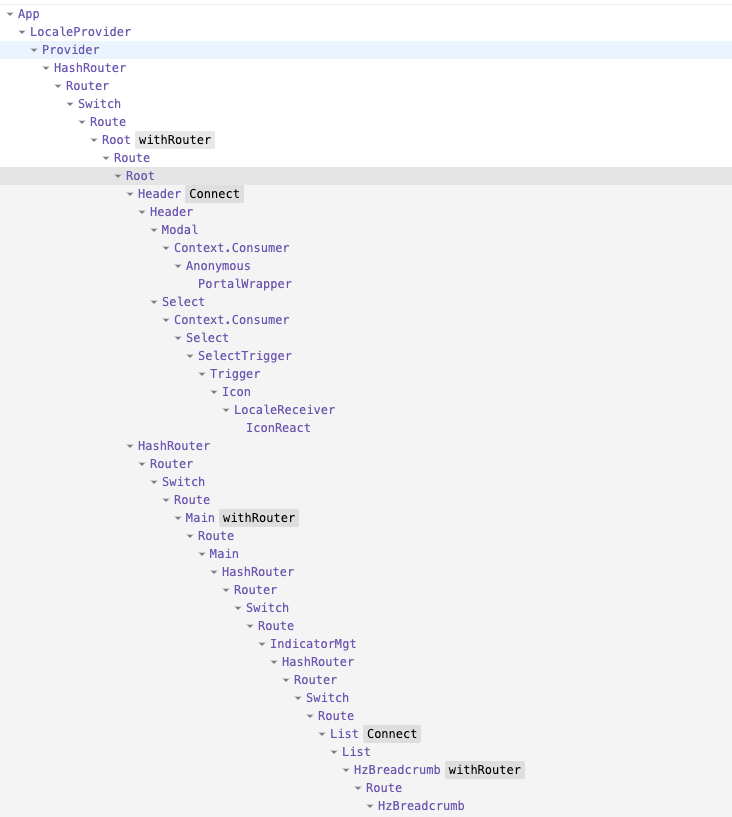

# React Hook
## React Hook 动机
```
1.在组件之间复用状态逻辑很难
2.复杂组件变得难以理解
3.难以理解的 class
```
**1.在组件之间复用状态逻辑很难**

React 没有提供将可复用性行为“附加”到组件的途径（例如，把组件连接到 `store`）。如果你使用过 `React` 一段时间，你也许会熟悉一些解决此类问题的方案，比如` render props` 和 高阶组件。但是这类方案需要重新组织你的组件结构，这可能会很麻烦，使你的代码难以理解。如果你在 `React DevTools` 中观察过 `React` 应用，你会发现由 `providers，consumers，`高阶组件，`render props` 等其他抽象层组成的组件会形成“嵌套地狱”。尽管我们可以在 DevTools 过滤掉它们，但这说明了一个更深层次的问题：React 需要为共享状态逻辑提供更好的原生途径。



你可以使用 `Hook` 从组件中提取状态逻辑，使得这些逻辑可以单独测试并复用。__Hook 使你在无需修改组件结构的情况下复用状态逻辑。__ 这使得在组件间或社区内共享 `Hook` 变得更便捷。

**2. 复杂组件变得难以理解**

我们经常维护一些组件，组件起初很简单，但是逐渐会被状态逻辑和副作用充斥。每个生命周期常常包含一些不相关的逻辑。例如，组件常常在 `componentDidMount 和 componentDidUpdate 中获取数据。但是，同一个 componentDidMount 中可能也包含很多其它的逻辑`，如设置事件监听，而之后需在 `componentWillUnmount` 中清除。相互关联且需要对照修改的代码被进行了拆分，而完全不相关的代码却在同一个方法中组合在一起。如此很容易产生 bug，并且导致逻辑不一致。

在多数情况下，不可能将组件拆分为更小的粒度，因为状态逻辑无处不在。这也给测试带来了一定挑战。同时，这也是很多人将 `React` 与状态管理库结合使用的原因之一。但是，这往往会引入了很多抽象概念，需要你在不同的文件之间来回切换，使得复用变得更加困难。

为了解决这个问题，__Hook 将组件中相互关联的部分拆分成更小的函数（比如设置订阅或请求数据）__，而并非强制按照生命周期划分。你还可以使用 reducer 来管理组件的内部状态，使其更加可预测。

**3. 难以理解的class**

除了代码复用和代码管理会遇到困难外，我们还发现 `class` 是学习 `React` 的一大屏障。你必须去理解 `JavaScript` 中 `this` 的工作方式，这与其他语言存在巨大差异。还不能忘记绑定事件处理器。

为了解决这些问题，__Hook 使你在非 class 的情况下可以使用更多的 React 特性。__ 从概念上讲，React 组件一直更像是函数。而 `Hook` 则拥抱了函数，同时也没有牺牲 React 的精神原则。Hook 提供了问题的解决方案，无需学习复杂的函数式或响应式编程技术。