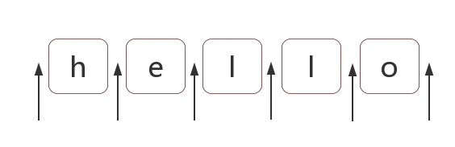

# 正则位置匹配

相邻是字符之间的位置，比如，下图中箭头所指的地方


## 如何匹配字符位置
``` 
 ^ $ \b \B (?=p) (?!p)
```
>  ^ 与 $ 匹配 开头 与 结尾

例如把字符串的开头和结尾用"#"替换
```js
let res="hello".replace(/^|$/,'#');
console.log(res) 
// => "#hello#"
```
> 多行匹配
```js
let res="I\nlove\njavascript".replace(/^|$/gm,"#")
console.log(result)
/*
#I#
#love#
#javascript#
*/
```
> \b 与 \B

\b是单词的边界，具体就是\w和\W之间的位置，也包括\w和^之间的位置，也包括\w和$之间的位置

比如一个文件名是"[js] lesson_01.mp4"中的\b 如下
```js
let res="[js] lesson_01.mp4".replace(/\b/g,"#")
console.log(res)
//=> "[#js#] #lesson_01#.#mp4#"
```
> 为什么会这样呢，仔细看
首先，\w是字符数组[0-9a-zA-Z_]的简写，即\w是字母数字或者下划线中的任一个字符。
而\W是排除[^0-9a-zA-Z_]的简写，即\W是\w之外的任一个字符 
那上面代码的执行结果 "[#js#] #lesson_01#.#mp4#" 是怎么来的呢

- 第一个"#"，两边是"["与"j", 是\W与\w之间的位置
- 第二个"#"，两边是"s"与"]", 是\w与\W之间的位置
- 第三个"#"，两边是空格与"l", 是\W与\w之间的位置
- 第四个"#"，两边是"1"与".", 是\w与\W之间的位置
- 同理其它"#" 以此类推...
> 依据上面的例子如果把所有的 \B替换成"#" 
```js
let res="[js] lesson_01.mp4".replace(/\B/g,"#")
console.log(res)
//=> "#[j#s]# l#e#s#s#o#n#_#0#1.m#p#4"
```

> (?=p) 与 (?!p)

(?=p), p 是一个子模式，即p前面的位置

比如(?=l) 表示'l'字符前面的位置，例如
```js
let res="hello".replace(/(?=l)/g,"#")
// => "he#l#lo"
```
而 (?!p) 就是 (?=p) 的反义词 例如
```js
let res="hello".replace(/(?!l)/g,"#")
// => "#h#ell#o#"
```
二者的学名分别是positive lookahead和negative lookahead。

中文翻译分别是正向先行断言和负向先行断言。

ES6中，还支持positive lookbehind和negative lookbehind。

具体是(?<=p)和(?<!p)。也有书上把这四个东西，翻译成环视，

即看看右边或看看左边。但一般书上，没有很好强调这四者是个位置。

比如(?=p)，一般都理解成：要求接下来的字符与p匹配，但不能包括p的那些字符。而在本人看来(?=p)就与^一样好理解，就是p前面的那个位置。

## 位置特性

对于位置的理解，我们可以理解成空字符""。

比如"hello"字符串等价于如下的形式：
```js
"hello" == "" + "h" + "" + "e" + "" + "l" + "" + "l" + "o" + "";
```
因此，把/^hello$/写成/^^hello?$/，是没有任何问题的：
```js
var result = /^^hello?$/.test("hello");
console.log(result); 
// => true
```
甚至可以写成更复杂的:
```js
var result = /(?=he)^^he(?=\w)llo$\b\b$/.test("hello");
console.log(result); 
// => true
```
也就是说字符之间的位置，可以写成多个。

把位置理解空字符，是对位置非常有效的理解方式。

## 相关案例

- 不匹配任何东西的正则

> /.^/  此正则要求只有一个字符 该字符后面是开头

- 数字千分位分隔符表示法

比如 12345678 -> 12,345,678

需要把相应的位置替换成 ","

> 弄出最后一个逗号 (?=\d{3}$) 就可以做到
```js
let res="12345678".replace(/(?=\d{3}$)/g,',')
// => "12345,678"
```
> 弄出所有的逗号 要求后面3个数字一组，也就是\d{3} 至少出现一次 因此可以使用量词 '+'
```js
let res='12345678'.replace(/(?=(\d{3})+$)/g,',')
// => "12,345,678"
```
> 其余匹配案例
```js
//以上匹配存在问题
let res='123456789'.replace(/(?=(\d{3})+$)/g,',')
// => ",123,456,789"

// 因为以上正则仅仅把从结尾向前数，一旦是3的倍数，就把其前面的位置换成 ',' 因此才出现这个问题
// 解决 要求匹配这个位置不能是开头 


// 要求这个位置不能是开头怎么办 (?!^)

let res='123456789'.replace(/(?!^)(?=(\d{3})+$)/g,',')
// => "123,456,789"
```
> 支持其他转换实现 比如把 "12345678 123456789"替换成"12,345,678 123,456,789"
> >此时需要修改正则 把里面的开头 ^ 和 $ 结尾 替换成 \b
```js 
let res="12345678 123456789".replace(/(?!\b)(?=(\d{3})+\b)/g,',')
// => "12,345,678 123,456,789"
```
> 其中(?!\b) 要求当前一个位置，但不是\b前面的位置，其实(?!\b) 即 \B
>> 因此最终正则变成了 /\B(?=(\d{3})+\b)/g
```js
let res="12345678 123456789".replace(/\B(?=(\d{3})+\b)/g,',')
// => "12,345,678 123,456,789"
```
- 验证密码长度问题

密码长度6-12位，由数字、小写字符和大写字母组成，但必须至少包括2种字符。

此题，如果写成多个正则来判断，比较容易。但要写成一个正则就比较困难。

那么，我们就来挑战一下。看看我们对位置的理解是否深刻。

> 不考虑"但必须至少包含2种字符"这一条件
```js
 let reg=/[0-9a-zA-Z]{6,12}$/
```
> 判断是否包含有某一种字符

假设，要求的必须是数字，此时可以使用 (?=.*[0-9])
```js
let reg=/(?=.*[0-9])^[0-9a-zA-Z]{6-12}$/
```
> 同时包含具体的两种字符

比如同时包含数字和小写字母 可以使用 (?=.*[0-9])(?=.*[a-z])
```js
let reg=/(?=.*[0-9])(?=.*[a-z])^[0-9a-zA-Z]{6,12}$/
```
### 解答
 我们可以把原题变换成下列几种情况之一
 1. 同时包含数字和小写字母
 2. 同时包含数字和大写字母
 3. 同时包含小写字母和大写字母
 4. 同时包含数字、小写字母和大写字母

以上的4种情况是或的关系(实际上，可以不用第四条)

先看一下例子

```js
'study'.replace(/(?=s)/, '#') // #study
'study'.replace(/(?=d)/, '#') // stu#dy
'study'.replace(/(?=^)/, '#') // #study
```
> 我们从而得知，是找到匹配的pattern后之前的位置，重点强调匹配到的是位置。
明白了这个，我们来理解下/(?=pattern)^/，及找到符合pattern的开始位置，并且该位置要在^之前，能在^之前的是什么？思考下。
```js
/^^study/.test('study') // true
```
> 看到这个应该就明白 ^之前的就只能是^，^是个锚点。
```js
/(?=\d)^/.test('9') // true
/(?=\d)^/.test('9l') // true
/(?=\d)^/.test('l9') // false
```
> 我们现在明白 /(?=\d)^/的意思是以数字开头的字符串。

到这里我们应该明白 /(?=.*[0-9])^/ 的意思是以任意字符(可以无)加数字开头。说白了就是必须包含数字
```js
/(?=.*[0-9])^/.test('9') // true
/(?=.*[0-9])^/.test('9l') // true
/(?=.*[0-9])^/.test('l9') // true

```
> 扩展

```js 
1、
`study`.replace(/$/, '#') // study#
`study`.replace(/$(?<=y)/, '#') //study#
`study`.replace(/(?<=d)/, '#') // stud#y

2、
`study1`.replace(/(?![a-z])/g, '#') //study#1#
`study`.replace(/(?![a-z])/g, '#') //study#
```
最终答案
```js
let reg=/((?=.*[0-9])(?=.*[a-z])|(?=.*[0-9])(?=.*[A-Z]|(?=.*[a-z])(?=.*[A-Z])))^[0-9A-Za-z]{6,12}$/;
console.log( reg.test("1234567") ); // false 全是数字
console.log( reg.test("abcdef") ); // false 全是小写字母
console.log( reg.test("ABCDEFGH") ); // false 全是大写字母
console.log( reg.test("ab23C") ); // false 不足6位
console.log( reg.test("ABCDEF234") ); // true 大写字母和数字
console.log( reg.test("abcdEF234") ); // true 三者都有

```
### 另一种解法
“至少包含两种字符”的意思就是说，不能全部都是数字，也不能全部都是小写字母，也不能全部都是大写字母。
> 那么要求“不能全部都是数字”，怎么做呢？(?!p)出马！

 (?!p)
```js
let  reg = /(?!^[0-9]{6,12}$)^[0-9A-Za-z]{6,12}$/;
```
> 三种都不能呢
```js
var reg = /(?!^[0-9]{6,12}$)(?!^[a-z]{6,12}$)(?!^[A-Z]{6,12}$)^[0-9A-Za-z]{6,12}$/;
console.log( reg.test("1234567") ); // false 全是数字
console.log( reg.test("abcdef") ); // false 全是小写字母
console.log( reg.test("ABCDEFGH") ); // false 全是大写字母
console.log( reg.test("ab23C") ); // false 不足6位
console.log( reg.test("ABCDEF234") ); // true 大写字母和数字
console.log( reg.test("abcdEF234") ); // true 三者都有

```


[文章参考](https://juejin.im/post/6844903487155732494)