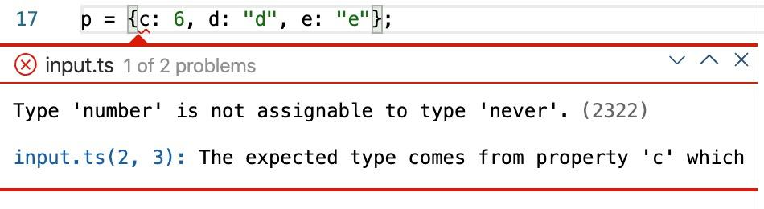
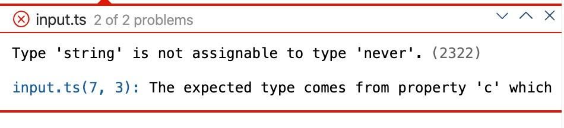
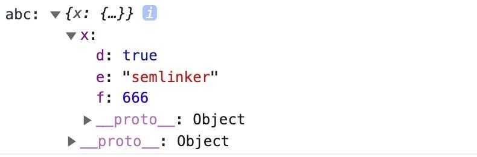
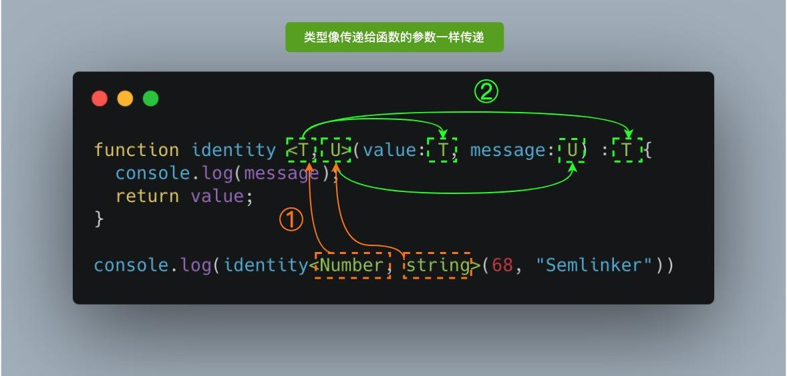
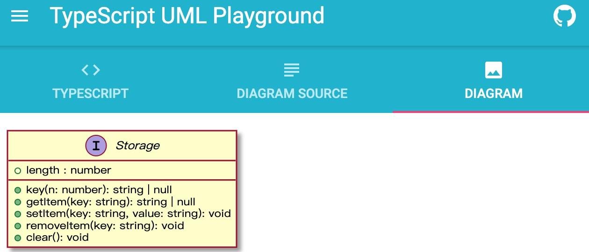
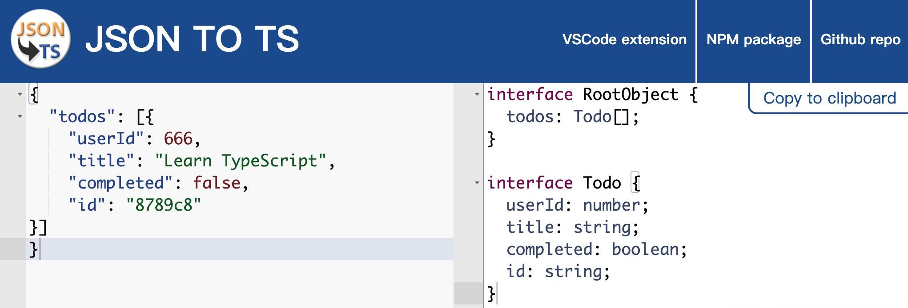
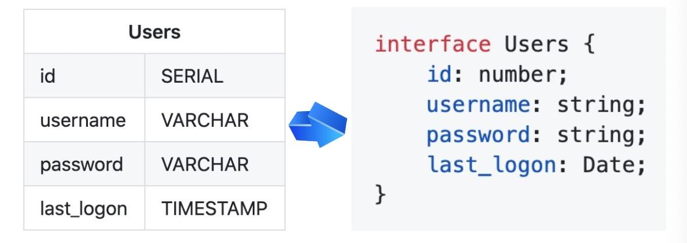
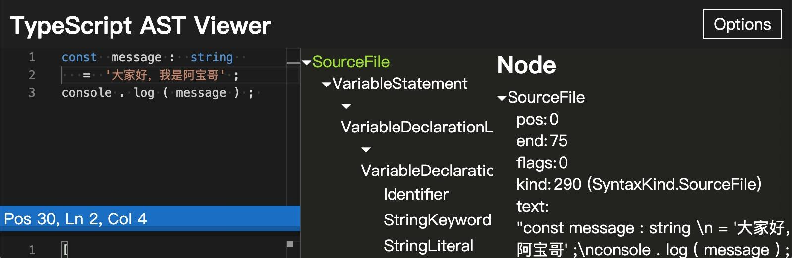

# TypeScript 与 JavaScript 的区别
|Typescript|Javascript|
|:-:|:-:|
|Javascript的超集用于解决大型项目的代码复杂性| 一种脚本语言，用于创建动态页面|
|可以在编译期间发现并纠正错误|作为一种解释型语言，只能在运行时发现错误|
|强类型，支持静态和动态类型|弱类型，没有静态类型选项|
|最终被编译成JavaScript代码，使浏览器可以理解|可以直接在浏览器中使用|
|支持模块，泛型和接口|不支持模块，泛型和接口|
社区的支持仍在增长，而且还不是很大|大量的社区支持以及大量的文档和解决问题支持|


默认情况下 null 和 undefined 是所有类型的子类型。 就是说你可以把 null 和 undefined 赋值给 number 类型的变量。然而，如果你指定了--strictNullChecks 标记，null 和 undefined 只能赋值给 void 和它们各自的类型。

Never类型

never类型表示的是那些永远不存在的值的类型。例如，never类型是那些总是会抛出异常或根本就不会有返回值的函数表达式或剪头函数表达式的返回值类型。

```ts
function error(message:string):never{
    throw new Error(message);
}

function infiniteLoop():never{
    while(true){}
}
```
在 TypeScript 中，可以利用 never 类型的特性来实现全面性检查，具体示例如下：

```ts
type Foo = string | number;

function controlFlowAnalysisWithNever(foo: Foo) {
  if (typeof foo === "string") {
    // 这里 foo 被收窄为 string 类型
  } else if (typeof foo === "number") {
    // 这里 foo 被收窄为 number 类型
  } else {
    // foo 在这里是 never
    const check: never = foo;
  }
}
```
注意在 else 分支里面，我们把收窄为 never 的 foo 赋值给一个显式声明的 never 变量。如果一切逻辑正确，那么这里应该能够编译通过。但是假如后来有一天你的同事修改了 Foo 的类型：
```ts
type Foo = string | number | boolean;
```
然而他忘记同时修改 controlFlowAnalysisWithNever 方法中的控制流程，这时候 else 分支的 foo 类型会被收窄为 boolean 类型，导致无法赋值给 never 类型，这时就会产生一个编译错误。通过这个方式，我们可以确保

controlFlowAnalysisWithNever 方法总是穷尽了 Foo 的所有可能类型。 通过这个示例，我们可以得出一个结论：使用 never 避免出现新增了联合类型没有对应的实现，目的就是写出类型绝对安全的代码。

# TypeScript 断言

类型断言有两种形式：
- "尖括号"语法
```ts
let someValue: any = "this is a string";
let strLength: number = (<string>someValue).length;
```
- as 语法
```ts
let someValue: any = "this is a string";
let strLength: number = (someValue as string).length;
```
- 非空断言

    - 忽略 undefined 和 null 类型
    
        在上下文中当类型检查器无法断定类型时，一个新的后缀表达式操作符 ! 可以用于断言操作对象是非 null 和非 undefined 类型。具体而言，x! 将从 x 值域中排除 null 和 undefined 。
        那么非空断言操作符到底有什么用呢？下面我们先来看一下非空断言操作符的一些使用场景。

    ```ts
        function myFunc(maybeString: string | undefined | null) {
            // Type 'string | null | undefined' is not assignable to type 'string'.
            // Type 'undefined' is not assignable to type 'string'. 
            const onlyString: string = maybeString; // Error
            const ignoreUndefinedAndNull: string = maybeString!; // Ok
        }
    ```
    - 调用函数时忽略undefined类型
    ```ts
        type NumGenerator = () => number;

        function myFunc(numGenerator: NumGenerator | undefined) {
            // Object is possibly 'undefined'.(2532)
            // Cannot invoke an object which is possibly 'undefined'.(2722)
            const num1 = numGenerator(); // Error
            const num2 = numGenerator!(); //OK
        }
    ```
    因为!非空断言操作符会从编译生成的JavaScript代码中移除，所以在实际使用的过程中，要特别注意。比如下面的例子
    ```ts
        const a: number | undefined = undefined;
        const b: number = a!;
        console.log(b); 
    ```
    > 以上TS代码会被编译成以下的ES5代码
    ```js
        "use strict";
        const a = undefined;
        const b = a;
        console.log(b);
    ```
    虽然在TS代码中，我们使用了非空断言，使得 `const b:number = a!;` 语句可以通过typescript类型检查器的检查，但是生成的ES5代码中，`!` 非空断言操作符被废除了，所以在浏览器中执行以上代码，在控制台会输出 `undefined` 。

    - 确定赋值断言
    在typescript 2.7版本中引入了确定赋值断言，即允许在实例属性和变量声明后面放置一个 `!` 符号，从而告诉typescript该属性会被明确地赋值，为了更好的理解它的作用，我们来看个具体的例子：
    ```ts
        let x: number;
        initialize();
        // Variable 'x' is used before being assigned.(2454)
        console.log(2 * x); // Error

        function initialize() {
            x = 10;
        }
    ```
    很明显该异常信息是说变量x在赋值前被使用了，要解决该问题，我们可以使用确定赋值断言：
    ```ts
        let x!: number;
        initialize();
        console.log(2 * x); // ok

        function initialize() {
            x = 10;
        }
    ```
    通过 `let x!:number;` 确定赋值断言，typescript编译器就会知道该属性会被明确地赋值

# 类型守卫

类型保护是可执行运行时检查的一种表达式，用于确保该类型在一定的范围内。 换句话说，类型保护可以保证一个字符串是一个字符串，尽管它的值也可以是一个数值。类型保护与特性检测并不是完全不同，其主要思想是尝试检测属性、方法或原型，以确定如何处理值。目前主要有四种的方式来实现类型保护：

1. in 关键字

```ts
interface Admin {
  name: string;
  privileges: string[];
}

interface Employee {
  name: string;
  startDate: Date;
}

type UnknownEmployee = Employee | Admin;

function printEmployeeInformation(emp: UnknownEmployee) {
  console.log("Name: " + emp.name);
  if ("privileges" in emp) {
    console.log("Privileges: " + emp.privileges);
  }
  if ("startDate" in emp) {
    console.log("Start Date: " + emp.startDate);
  }
}
```

2. typeof 关键字
```ts
function padLeft(value: string, padding: string | number) {
  if (typeof padding === "number") {
      return Array(padding + 1).join(" ") + value;
  }
  if (typeof padding === "string") {
      return padding + value;
  }
  throw new Error(`Expected string or number, got '${padding}'.`);
}
```

typeof 类型保护只支持两种形式：typeof v === "typename" 和 typeof v !== typename，"typename" 必须是 "number"， "string"， "boolean" 或 "symbol"。 但是 TypeScript 并不会阻止你与其它字符串比较，语言不会把那些表达式识别为类型保护。

3. instanceof 关键字
```ts
interface Padder {
  getPaddingString(): string;
}

class SpaceRepeatingPadder implements Padder {
  constructor(private numSpaces: number) {}
  getPaddingString() {
    return Array(this.numSpaces + 1).join(" ");
  }
}

class StringPadder implements Padder {
  constructor(private value: string) {}
  getPaddingString() {
    return this.value;
  }
}

let padder: Padder = new SpaceRepeatingPadder(6);

if (padder instanceof SpaceRepeatingPadder) {
  // padder的类型收窄为 'SpaceRepeatingPadder'
}
```

4. 自定义类型保护的类型谓词

```ts
function isNumber(x: any): x is number {
  return typeof x === "number";
}

function isString(x: any): x is string {
  return typeof x === "string";
}
```

# 类型别名 

类型别名用来给一个类型起一个新的名字

```ts
    type Message = string | string[];
    let greet = (message:Message)=>{
        //...
    }
```

# 交叉类型

在Typescript中交叉类型是将多个类型合并为一个类型。通过 `&` 运算符将现有的多个类型叠加到一起成为一种新的类型，它包含了所需的所有的类型特性。

```ts
    type PartialPointX = { x: number};
    type Point = PartialPoint & { y: number};

    let point: Point = {
        x: 1,
        y: 1
    }
```
> 上面的代码中我们先定义了 `PartialPoinrX` 类型，接着使用 `&` 运算符创建一个新的 `Point` 类型，表示一个含有 `x` 和 `y` 坐标的点，然后定义一个 `Point` 类型的变量并初始化。

- 同名基础类型属性的合并

假设在合并多个类型的过程中，刚好出现某些类型存在相同的成员，但是对应的类型又不一致，
```ts
interface X {
  c: string;
  d: string;
}

interface Y {
  c: number;
  e: string
}

type XY = X & Y;
type YX = Y & X;

let p: XY;
let q: YX;
```
对于这种情况，此时XY类型或YX类型中成员c的类型是不是可以是 `number` 或 `string` 类型呢 

示例：

```ts
p = { c: 6, d: "d", e: "e" }; 
```

```ts
p = { c: 'c', d: "d", e: "e" }; 
```


为什么接口X和接口Y混入后，成员c的类型会变成 `never` 呢？这是因为混入成 `c` 的类型 `string & number` ，即成员 `c` 的类型既可以是 `string` 类型也可以是 `number` 类型。
很明显这种类型是不存在的，所以混入成员 `c` 的类型为 `never`

- 同名非基础类型属性的合并

在上面的示例中，刚好接口`X`和`Y`中的成员`c`的类型都是基本数据类型，那么如果是非基本数据类型的话，又会是什么情形呢？

```ts
interface D { d: boolean; }
interface E { e: string; }
interface F { f: number; }

interface A { x: D; }
interface B { x: E; }
interface C { x: F; }

type ABC = A & B & C;

let abc: ABC = {
  x: {
    d: true,
    e: 'semlinker',
    f: 666
  }
};

console.log('abc:', abc);
```
以上代码运行成功后会输出以下结果：

> 由图可知，在混入多个类型时，若存在相同的成员，且成员类型为非基本数据类型，那么是可以成功合并的。

# Typescript 函数

**Typescript函数与JavaScript函数的区别**
|Typescript|JavaScript|
|:-:|:-:|
|含有类型|无类型|
|箭头函数|箭头函数（ES2015）|
|函数类型|无函数类型|
|必填和可选参数|所有参数都是可选的|
|默认参数|默认参数|
|剩余参数|剩余参数|
|函数重载|无函数重载|


- 参数类型和返回类型

```ts
    function createUserId(name:string,id:number):string{
        return name+id
    }
```
- 函数类型
```ts
    let IdGenerator: ( chars: string, nums: number ) => string;
    function createUserId(name:string,id:number):string{
        return name+id
    }
    IdGenerator = createUserId
```
- 可选参数和默认参数
```ts
    //可选参数
    function createUserId(name:string,id:number,age?:number):string{
        return name+id
    }

    //默认参数
    function createUserId(
            name:string='tom',
            id:number,
            age?number
        ):string{
            return name+id
    }
```

在声明函数时，可以通过 `?` 符号来定义可选参数，比如 `age?: number` 这种形式，**在实际使用时，需要注意的是可选参数需要放在普通参数的后面，不然会导致编译错误。**

- 剩余参数

```ts
    function push(array, ...items ){
        items.forEach(function(item){
            array.push(item)
        })
    }
    let a = [];
    push(a, 1,2,3)
```

- 函数重载

函数重载或方法重载是**使用相同名称**和**不同参数数量或类型创建多个方法**的一种能力。
```ts
function add(a: number, b: number): number;
function add(a: string, b: string): string;
function add(a: string, b: number): string;
function add(a: number, b: string): string;
function add(a: Combinable, b: Combinable) {
  // type Combinable = string | number;
  if (typeof a === 'string' || typeof b === 'string') {
    return a.toString() + b.toString();
  }
  return a + b;
}
```

在上面的代码中，我们为 `add` 函数提供了多个函数类型的定义，从而实现了函数的重载，在Typescript中除了可以重载普通函数之外，我们还可以重载类中的成员方法。

方法重载是指在同一个类中方法名相同，参数不同（类型不同、参数个数不同、参数个数形同时参数的先后顺序不同），调用时根据实参的形式，选择与它匹配的方法执行操作的一种技术。所以类中成员方法满足重载条件是：在同一个类中，**方法名形同且参数不同**。

**示例：**
```ts
class Calculator {
  add(a: number, b: number): number;
  add(a: string, b: string): string;
  add(a: string, b: number): string;
  add(a: number, b: string): string;
  add(a: Combinable, b: Combinable) {
  if (typeof a === 'string' || typeof b === 'string') {
    return a.toString() + b.toString();
  }
    return a + b;
  }
}

const calculator = new Calculator();
const result = calculator.add('Semlinker', ' Kakuqo');
```
这里需要注意的是，当Typescript编译器处理函数重载时，它会查找重载列表，尝试使用第一个重载定义。如果匹配的话就使用这个。因此，在定义重载的时候，一定要把最精确的定义放在最前面，另外在Calculator类中，`add(a: Combinable, b: Combinable){ }` 并不是重载列表的一部分，因此对于add成员的方法来说，我们只定义了四个重载的方法。

# 接口与类型别名的区别

1. Object/Functions

接口和类型别名都可以用来描述对象的形状或函数的签名

**接口**
```ts
    interface Point{
        x: number;
        y: number;
    }

    interface SetPoint{
        (x: number, y: number): void;
    }
```
类型别名
```ts
    type Point{
        x: number;
        y: number;
    }

    type SetPoint = (x: number, y: number) => void;
```

2. Other Types

与接口类型不一样，类型别名可以用于一些其他类型，比如原始类型、联合类型和元组：

```ts
    // primitive
    type Name = string;

    // object
    type PartialPonitX = {x: number;};
    type PartialPonitY = {y: number;};

    //union
    type PartialPonit = PartialPonitX | PartialPonitY;

    //tuple
    type Data = [number,string]
```

3. Extend

接口和类型别名都能够被扩展，但语法有所不同。此外，接口和类型别名不是互斥的，接口可以扩展类型别名，而反过来也是可以的。

Interface extends interface

```ts
    interface PartialPointX {x: number;}
    interface Point extends PartialPointX{
        y: number;
    }
```

Type alias extends Type alias

```ts
    type PartialPointX = {x: number;};
    type Point = PartialPointX & {y: number;};
```
Interface extends type alias

```ts
    type PartialPointX = {x: numbet;};
    interface Point extends PartialPointX {
        y: number;
    }
```

type alias extends interface

```ts
    interface PartialPointX {x: number;};
    type Point = PartialPointX & {
        y: number;
    }
```

- Implements

类可以以相同的方式实现接口或类型别名，但类不能实现使用类型别名定义的联合类型：

```ts
    interface Point{
        x: number;
        y: number;
    }

    class SomePoint implements Ponint {
        x: 1;
        y: 2;
    }

    type Point2 = {
        x: number;
        y: number;
    }

    class SomePoint2 implements Ponint2 {
        x: 1;
        y: 2;
    }

    type Partialpoint = { x: number } | { y: number };

    //A class can only implement an object type or intersection of object types with statically known members.
    class SomePartialPoint implements PartialPoint {
        // Error
        x = 1;
        y = 2;
    }
```

- Declaration merging

与类型别名不同，接口可以定义多次，会被自动合并为单个接口。

```ts
    interface Point {x: number; }
    interface Point {y: number; }

    const point: Point = {x: 1, y:2 }
```

# Typescript 类

在面向对象语言中，类是一种面向对象计算机编程语言的构造，是创建对象，描述创建对象共同的属性和方法。

在Typescript中，我们可以通过 `Class` 关键字来定义一个类：

```ts
    class Greeter {
        //静态属性
        static name: string = 'greeter';

        //成员属性
        greeting: string ;

        //构造函数 - 执行初始化操作
        constructor(message: string){
            this.greeting = message;
        }

        //静态方法
        static getClassName(){
            return "Class name is greeter";
        }

        //成员方法
        greet(){
            return "hello"+ this.greeting;
        }
    }

    let greeter = new Greeter('world')
```

那么成员属性与静态属性，成员方法与静态方法有什么区别呢？
看下面编译生成的ES5代码：

```js
    "use strict";
    var Greeter = /** @class */ (function () {
        // 构造函数 - 执行初始化操作
        function Greeter(message){
            this.greeting = message;
        }

        //静态方法

        Greeter.getClassName = function (){
            return "Class name is greeter";
        }

        //成员方法
        Greeter.prototype.greet = function () {
            return "hello"+ this.greeting;
        }

        //静态属性
        Greeter.name = 'greeter';

        return Greeter
    })()

    var greeter = new Greeter('world')

```

- ECMAScript 私有字段

在Typescript3.8 版本就开始支持**ECMAScript 私有字段**，使用方式入下

```ts
    class Person {
        #name: string;

        constructor(name: string){
            this.#name = name;
        }
        greet(){
            console.log(`Hello, my name is ${this.#name}!`);
        }
    }

    let tom = new Person('tom')

    tom.#name;

    // Property '#name' is not accessible outside class 'Person'
    // because it has a private identifier.
```
与常规属性（甚至使用 private 修饰符声明的属性） 不同，私有字段要牢记以下规则：

1. 私有字段以 `#` 字符开头，有时我们称之为私有名称；
2. 每个私有字段名称都唯一地限定于其包含的类；
3. 不能在私有字段上使用Typescript可以访问性修饰符如（public 或 private ）
4. 私有字段不能在包含的类之外访问，甚至不能被检测到。

- 继承

在Typescript中通过 `extends` 关键字来实现继承：

```ts
    class Animal {
        name: string;

        constructor(theName: string){
            this.name = theName;
        }

        move(distance: number = 0){
            console.log(`${this.name} moved ${distance}m.`)
        }
    }

    class Cat extends Animal {
        constructor(name: string){
            super(name); // 调用父类的构造函数
        }

        move(distance = 15){
            console.log('miao ....')
            super.move(distance)
        }
    }

    let littleCat = new Cat('xiao hua miao');
    littleCat.move()
```

- 抽象类

使用 `abstract` 关键字声明的类，称之为抽象类。抽象类不能被实例化，因为它里面包含一个或多个抽象方法，所谓的抽象方法，是指不包含具体实现的方法：
```ts
    abstract class Person {
        constructor(public name: string){}

        abstract eat(something: string): void;
    }

    // Connot create an instance of an abstract class.
    const tom = new Person(); // Error
```
抽象类不能被直接实例化，我们只能实例化实现了所有抽象方法的子类，具体如下：

```ts
    abstract class Person {
        constructor(public name: string){}

        abstract eat(something: string): void;
    }

    class ChinaPerson extends Person {
        constructor(name: string){
            super(name)
        }

        eat(something: string): void{
            console.log(`I am ${this.name}, from china, I like eat ${something}`)
        }
    }
    
    const Lily = new ChinaPerson('Lily');
    Lily.eat('dumplings') //I am Lily, from china, I like eat dumplings`
```

- 类方法重载

前面已经介绍过了重载，对于类方法来说也是支持重载的，如下示例代码所示：

```ts
    class DinnerTime {
        haveDinner(): void;
        haveDinner(food: string): void;
        haveDinner(food: string,drinks?: string){
            if(typeof drinks === 'string'){
                console.log(`丰盛的晚餐，有吃的 ${food},有喝的${drinks}`)
            }else{
                console.log(`正在减肥，晚餐吃 ${food}`)
            }
        }
    }

    const LilysDinner = new DinnerTime();

    LilysDinner.haveDinner('dumplings','milk')

    LilysDinner.haveDinner('apple')
```

# 泛型

泛型（Generics）是允许同一个函数接受不同类型参数的一种模板，相比于使用any类型，使用泛型来创建可复用的组件要更好，因为泛型会保留参数类型。

- 泛型语法


参考上面的图片，当我们调用 `identity<Number>(1), Number` 类型就像参数 `1`一样，它将在出现 `T` 的任何位置填充该类型。图中 `<T>` 内部的 `T` 被称之为类型变量，它是我们希望传递给identity函数的类型占位符，同时它被分配给 `value` 参数来替代它的类型：此时 `T` 充当的是类型，而不是特定的 `Number` 类型。

其中 `T` 代表 **Type**，在定义泛型时通常用作第一个类型变量名称。但实际上 `T` 可以用任何有效名称代替，除了 `T` 之外，以下是常见泛型变量代表的意思：

> - K (Key): 表示对象中键类型；
> - V (Value): 表示对象的值的类型；
> - E (Element): 表示元素类型。

其实并不是只能定义一个类型变量，我们可以引入希望定义的任何数量的类型变量。比如我们引入一个新的类型变量 `U`,用于扩展我们定义的 `identity` 函数：

```ts
    function identity <T,U>(value: T, message: U): T{
        console.log(message);
        return value;
    }

    console.log(identity<Number, string>(68,'Semlinker'));
```



除了显式为变量设定值之外，一种更常见的做法是使编译器自动选择这些类型，从而使代码更简洁。我们可以完全省略尖括号，比如：
```ts
    function identity <T,U>(value: T, message: U): T{
        console.log(message);
        return value;
    }

    console.log(identity(68,'Semlinker'));
```

对于以上代码，编译器足够聪明，能够知道我们的参数类型，并将它们赋值给 `T` 和 `U`，不需要开发人员显示指定它们。

- 泛型接口
```ts
    interface GenerticIdentityFn<T>{
        (arg: T): T;
    }
```
- 泛型类型

```ts
    class GenericNumber<T> {
        zeroValue: T;
        add: (x: T,y: T) => T;
    }

    let myGenericNumber = new GenericNumber<number>();
    myGenericNumber.zeroValue = 0;
    myGenericNumber.add = function (x,y){
        return x + y;
    }
```

- 泛型工具类型

为了方便开发者，Typescript 内置了一些常用的工具类型，比如 Partial 、Required、Readonly、Record和ReturnType等。先来学习一些基础知识

1. 在Typescript中， `typeof` 操作符可以用来获取一个变量声明或对象的类型。

```ts
    interface Person {
        name: string;
        age: number;
    }

    const tom: Person = {name: 'tom', age: 22};

    type Tom = typeof tom; // -> person

    function toArray(x: number): Array<number>{
        retun [x]
    }

    type Func = typeof toArray; // -> (x: number) => number[]
```

2. keyof 

    `keyof` 操作符是在Typescript2.1版本因引入的，该操作可以用于获取某种类型的所有键，其返回类型是联合类型。

    ```ts
        interface Person {
            name: string;
            age: number;
        }

        type K1 = keyof Person; // -> "name" | "age"
        type K2 = keyof Person[]; // -> "toString" | "pop" | "push" | "concat" | "join" 
        type K3 = keyof {[x: string]: Person}; // -> string | number
    ```
    在typescript中支持两种索引签名，数字索引和字符串索引：

    ```ts
        interface StringArray {
            // 字符串索引 -> keyof StringArray => string | number
            [index: string]: string;
        }

        interface StringArray1 {
            // 数字索引 -> keyof StringArray1 => number
            [index: number]: string;            
        }
    ```
    为了同时支持两种索引类型，就得要求数字索引的返回值必须是字符串索引返回值的子类。**其中的原因就是当使用数值索引时，JavaScript在执行索引操作时，会先把数字索引转换成字符串索引。** 所以 `keyof { [x:string]: Person }` 返回的结果会是 `string | number`。

3. in 

    in 用来遍历枚举类型

    ```ts
        type keys = "a" | "b" | "c"

        type Obj = {
            [p in keys]:any
        } // -> {a:any, b:any, c:any}
    ```

4. infer 

    在条件类型语句中，可以用 `infer` 声明一个类型变量并且对它进行使用。

    ```ts
        type ReturnType<T> = T extends (
            ...args: any[]
        ) => infer R ? R :any;
    ```

    以上代码中 `infer R` 就是声明一个变量来承载传入函数签名的返回值类型，简单说就是用它取到函数返回值的类型方便之后使用。

5. extends

    有时候我们定义的泛型不想过于灵活或者说想继承某些类等，可以通过extends关键字添加泛型约束。

    ```ts
        interface Lengthwise {
            length: number ;
        }

        function loggingIdentity<T extends Lengthwise>(arg: T): T {
            console.log(arg.length);
            return arg
        }
    ```

    现在这个泛型函数被定义了约束，因此它不再是适用于任意类型：

    ```ts
        loggingIdentity(2); // Error, number doesn't have a .length property
    ```

    这时我们需要传入符合约束类型的值，必须包含必须的属性：

    ```ts
        loggingIdentity({length: 10, name:'tom'}); 
    ```
6. Partial 

    `Partial<T>`的作用就是将某个类型里的属性全部变为可选项 `?`

    定义：

    ```ts
        /**
         * node_modules/typescript/lib/lib.es5.d.ts
        * Make all properties in T optional
        */
        type Partial<T> = {
            [P in keyof T]?: T[P];
        };
    ```
    在以上 代码中，首先通过 `keyof T` 拿到 `T` 的所有的属性名，然后使用 `in` 进行遍历，将值赋给 `P` ，左后通过 `T[P]` 取得相应的属性值。 中间的 `?` 符号，用于将所有属性变为可选。

    示例

    ```ts
       interface Todo {
           title: string;
           description: string;
       } 

       function updateTodo(todo: Todo, fieldsToUpdate: Partial<Todo>){
           return {...todo, ...fieldsToUpdate};
       }

       const todo1 = {
           title: 'Learn Ts',
           description: 'Learn Typescript',
       }

       const todo2 = updateTodo(todo1,{
           description:'Learn Typescript Enum'
       })
    ```

   在上面的 `updateTodo` 方法中 ，我们利用 `Partial<T>`工具类型，定义 `fieldsToUpdate` 的类型为 `Partial<Todo>`,即：

    ```ts
    {
        title?: string | undefined;
        description?: string | undefined;
    }
    ```
7. Record
`Record<K extends keyof any, T>`的作用是将`K`中所有的属性值转化为`T`类型
**定义**
```ts
/**
 * node_modules/typescript/lib/lib.es5.d.ts
 * Construct a type with a set of properties K of type T
 */
type Record<K extends keyof any, T> = {
 [P in K]: T;
};
```

**示例**
```ts
interface PageInfo {
 title: string;
}
type Page = "home" | "about" | "contact";
const x: Record<Page, PageInfo> = {
 about: { title: "about" },
 contact: { title: "contact" },
 home: { title: "home" }
};
```

8. Pick
`Pick<T, K extends keyof T>`的作用是将某个类型中的子属性挑出来，变成包含这个类型部分属性的子类型。

**定义**

```ts
// node_modules/typescript/lib/lib.es5.d.ts
/**
 * From T, pick a set of properties whose keys are in the union K
 */
type Pick<T, K extends keyof T> = {
 [P in K]: T[P];
};
```

**示例**

```ts
interface Todo{
    title:string;
    description:string;
    completed:boolean;
}

type TodoPreview = Pick<Todo, "title" | "completed">;

const todo:TodoPreview = {
    title:'ts',
    completed:true
}
```
9. Exclude
`Exclude<T, U>`的作用是将某个类型中属于另一个的类型移除掉。

**定义**

```ts
// node_modules/typescript/lib/lib.es5.d.ts
/**
 * Exclude from T those types that are assignable to U
 */
type Exclude<T, U> = T extends U? never: T;
```
如果`T`能赋值给`U`类型的话，那么就返回`never`类型，否则就返回`T`类型。最终实现的效果就是将`T`中某些属于`U`的类型移除掉。

**示例**
```ts
type T0 = Exclude<'a' | 'b' | 'c', 'a'>; // 'b' | 'c'
type T1 = Exclude<'a' | 'b' | 'c', 'a' | 'b' >; // 'c'
type T2 = Exclude<string | number | (()=> void), Function>; //string | number
```
10. ReturnType
`ReturnType<T>`的作用是用于获取函数`T`的返回类型。

**定义**
```ts
// node_modules/typescript/lib/lib.es5.d.ts
/**
 * Obtain the return type of a function type
 */
 type ReturnType<T extends (...args: any) => any> = T extends (...args: any) => infer R? R : any;
 ```
 **示例**
 ```ts
 type T0 = ReturnType<()=>string>; //string
 type T1 = ReturnType<(s:string)=>void>; //void
 type T2 = ReturnType<<T>() => T>; // {}
 type T3 = ReturnType<<T extends U, U extends number[]>() => T>; //number []
 type T4 = ReturnType<any>; // any
 type T5 = ReturnType<never>; //any
 type T6 = ReturnType<string>; //Error
 type T7 = ReturnType<Function>; //Error
 ```
 
# Typescript 装饰器

- 装饰器什么？
        
    1. 他是一个表达式
    2. 该表达式被执行后，返回一个函数
    3. 函数的入参分别为 target 、name 和 descriptor
    4. 执行函数后，可能返回descriptor对象，用于配置target对象

- 装饰器的分类

    1. 类装饰器 （ Class decorators ）
    2. 属性装饰器 （ Property decorators ）
    3. 方法装饰器 （ Method decorators ）
    4. 参数装饰器 （ Parameter decorators ）

需要注意的是，若要启用实验性的装饰器特性，你必须在命令行或 `tsconfig.json` 里启用 `experimentalDecorators` 编译器选项。

**命令行：**

```ts
    tsc --target ES5 --experimentalDescorators
```
**tsconfig.json:**
```json
    {
        "compilerOptions":{
            "target":"ES5",
            "experimentalDecorators": true
        }
    }
```
- 类装饰器

类装饰器声明：

```ts
    declare type ClassDecorator = <TFunction extends Function>{
        target: TFunction
    } => TFunction | void;
```

类装饰器顾名思义就是用来装饰类的，它接收一个参数：

target：TFunction  被装饰的类

**示例：**

```ts
    function Greeter(target: Function): void{
        target.prototype.greet = function (): void {
            console.log("Hello tom");
        }
    }

    @Greeter
    class Greeting {
        constructor (){
            // 内部实现
        }
    }

    let myGreeting = new Greeting();
    myGreeting.greet(); // Hello tom
```

上面的例子中，我们定意思了 `Greeter` 类装饰器，同时我们使用了 `@Greeter` 语法糖，来使用装饰器。

装饰器传参

```ts
    function Greeter(greeting: string): void{
        return function (target: Function){
            target.prototype.greet = function (): void {
                console.log(greeting);
            }
        }
    }

    @Greeter("Hi Ts!")
    class Greeting {
        constructor (){
            // 内部实现
        }
    }

    let myGreeting = new Greeting();
    myGreeting.greet(); // Hi Ts!
```

- 属性装饰器

属性装饰器声明：

```ts
    declare type PropertyDecorator = (target: Object, propertyKey: string | symbol ) => void ;
```
属性装饰器顾名思义，用来装饰类的属性的，它接收两个参数：

    1. target: Object 被装饰的类
    2. propertyKey: string | symbol 被装饰的属性名

**示例：**
```ts
    function logProperty (target: any, key: string){
        delete target[key];

        const backingField = "_" + key ;

        Object.defineProperty(target, backingField, {
            writable: true,
            enumerable: true,
            configurable: true,
        })

        // property getter
        const getter = function (this: any){
            const currVal = this[backingField];
            console.log(`Get: ${key} => ${currVal}`)
            return currVal
        }

        // property setter
        const setter = function (this: any, newVal: any){
            console.log(`Set: ${key} => ${newVal}`)
            this[backingField] = newVal;
        }

        // Create new property with getter and setter
        Object.defineProperty(target, key, {
            get: getter,
            set: setter,
            enumerable: true,
            configurable: true,
        })
    }

    class Person {
        @logProperty
        public name: string;

        constructor(name: string){
            this.name = name;
        }
    }

    const p1 = new Person('tom');
    p1.name = "Lily";
    p1.name
    //[LOG]: Set: name => tom 
    //[LOG]: Set: name => Lily 
    //[LOG]: Get: name => Lily 
```
以上代码我们定义了一个 `logProperty` 函数，来跟踪用户对属性的操作，当代码成功运行后，在控制台会输出以下结果：
```js
    Set: name => tom 
    Set: name => Lily 
    Get: name => Lily 
```

- 方法装饰器

方法装饰器声明：

```ts
    declare type MethodDecorator = <T>(target:Object, propertyKey: string | symbole, descriptor: TypePropertyDescript<T>) => TypedPropertyDescriptor<T> | void;
```

方法装饰器顾名思义，用来装饰类的方法，它接收三个参数：

> - target: Object 被装饰的类
> - propertyKey: string | symbol 方法名
> - descriptor: TypePropertyDescript 属性描述符

**示例：**

```ts
    function LogOutput(tarage: Function, key: string, descriptor: any) {
    let originalMethod = descriptor.value;
    let newMethod = function(...args: any[]): any {
        let result: any = originalMethod.apply(this, args);
        if(!this.loggedOutput) {
        this.loggedOutput = new Array<any>();
        }
        this.loggedOutput.push({
        method: key,
        parameters: args,
        output: result,
        timestamp: new Date()
        });
        return result;
    };
    descriptor.value = newMethod;
    }

    class Calculator {
    @LogOutput
    double (num: number): number {
        return num * 2;
    }
    }

    let calc = new Calculator();
    calc.double(11);
    // console ouput: [{method: "double", output: 22, ...}]
    console.log(calc.loggedOutput); 
```

- 参数装饰器

参数装饰器声明：

```ts
    declare type ParameterDecorator = (targrt:Object, propertyKey: string | symbol, parameterIndex: number) => void
```

参数装饰器顾名思义，用来装饰函数参数，它接收三个参数：

> - target: Object 被装饰的类
> - propertyKey: string | symbol 方法名
> - parameterIndex: number  方法中参数的索引值

```ts
    function Log(target: Function, key: string, parameterIndex: number){
        let Logged = key || target.prototype.constructor.name;
        console.log(`The parameter in position ${parameterIndex} at ${Logged} has been decorated`)
    }

    class Greeter {
        greeting: string;

        constructor(@Log phrase: string){
            this.greeting = phrase
        }
    }
    // The parameter in position 0 at Greeter has been decorated
```

# TS 好用工具

- [TypeScript Playground](www.typescriptlang.org/play/)

> 简介：TypeScript 官方提供的在线 TypeScript 运行环境，利用它你可以方便地学习 TypeScript 相关知识与不同版本的功能特性。

在线地址：www.typescriptlang.org/play/

除了 TypeScript 官方的 Playground 之外，你还可以选择其他的 Playground，比如 [codepen.io](https://codepen.io/)、[stackblitz](https://stackblitz.com/) 或 [jsbin.com](https://jsbin.com/?js) 等。

- [TypeScript UML Playground](https://tsuml-demo.firebaseapp.com/)

> 简介：一款在线 TypeScript UML 工具，利用它你可以为指定的 TypeScript 代码生成 UML 类图。

在线地址：tsuml-demo.firebaseapp.com/



- [JSON TO TS](http://www.jsontots.com/)

> 简介：一款 TypeScript 在线工具，利用它你可以为指定的 JSON 数据生成对应的 TypeScript 接口定义。

在线地址：www.jsontots.com/



除了使用 jsontots 在线工具之外，对于使用 VSCode IDE 的小伙们还可以安装 JSON to TS 扩展来快速完成 JSON to TS 的转换工作。

- [Schemats](https://github.com/SweetIQ/schemats)

> 简介：利用 Schemats，你可以基于（Postgres，MySQL）SQL 数据库中的 schema 自动生成 TypeScript 接口定义。

在线地址：https://github.com/SweetIQ/schemats



- [TypeScript AST Viewer](https://ts-ast-viewer.com/)
> 简介：一款 TypeScript AST 在线工具，利用它你可以查看指定 TypeScript 代码对应的 AST（Abstract Syntax Tree）抽象语法树。

在线地址：ts-ast-viewer.com/



对于了解过 AST 的小伙伴来说，对 [astexplorer](https://astexplorer.net/) 这款在线工具应该不会陌生。该工具除了支持 JavaScript 之外，还支持 CSS、JSON、RegExp、GraphQL 和 Markdown 等格式的解析。

- [TypeDoc](https://typedoc.org/)

> 简介：TypeDoc 用于将 TypeScript 源代码中的注释转换为 HTML 文档或 JSON 模型。它可灵活扩展，并支持多种配置。

在线地址：typedoc.org/

- [TypeScript ESLint](https://github.com/typescript-eslint/typescript-eslint)

> 简介：使用 TypeScript ESLint 可以帮助我们规范代码质量，提高团队开发效率。

在线地址：typescript-eslint.io/

对 TypeScript ESLint 项目感兴趣且想在项目中应用的小伙伴，可以参考 [“在Typescript项目中，如何优雅的使用ESLint和Prettier” 这篇文章](https://juejin.im/post/6844903880006844424)。
能坚持看到这里的小伙伴都是 “真爱”，如果你还意犹未尽，那就来看看本人整理的 Github 上 1.8K+ 的开源项目：[awesome-typescript](https://github.com/semlinker/awesome-typescript)。


[文章参考](https://juejin.im/post/6872111128135073806)
[文档](https://jkchao.github.io/typescript-book-chinese/project/compilationContext.html#tsconfig-json)

